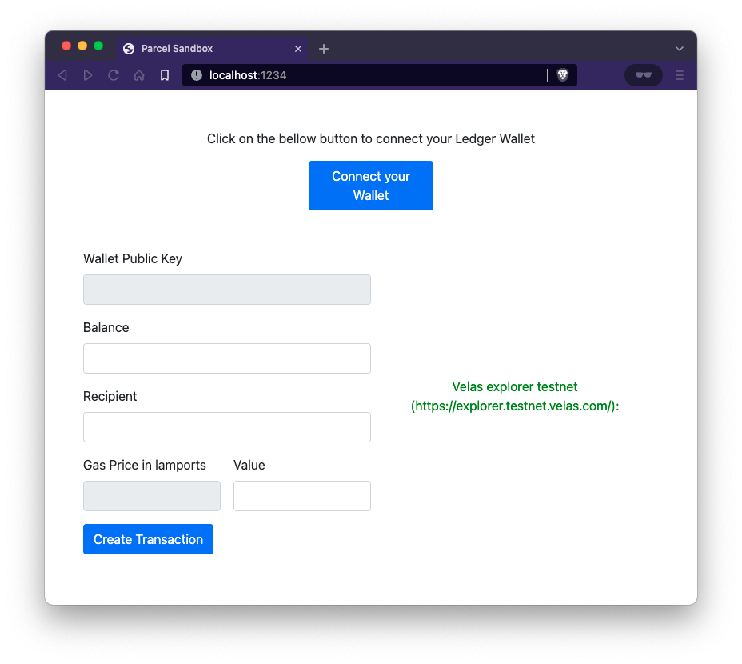
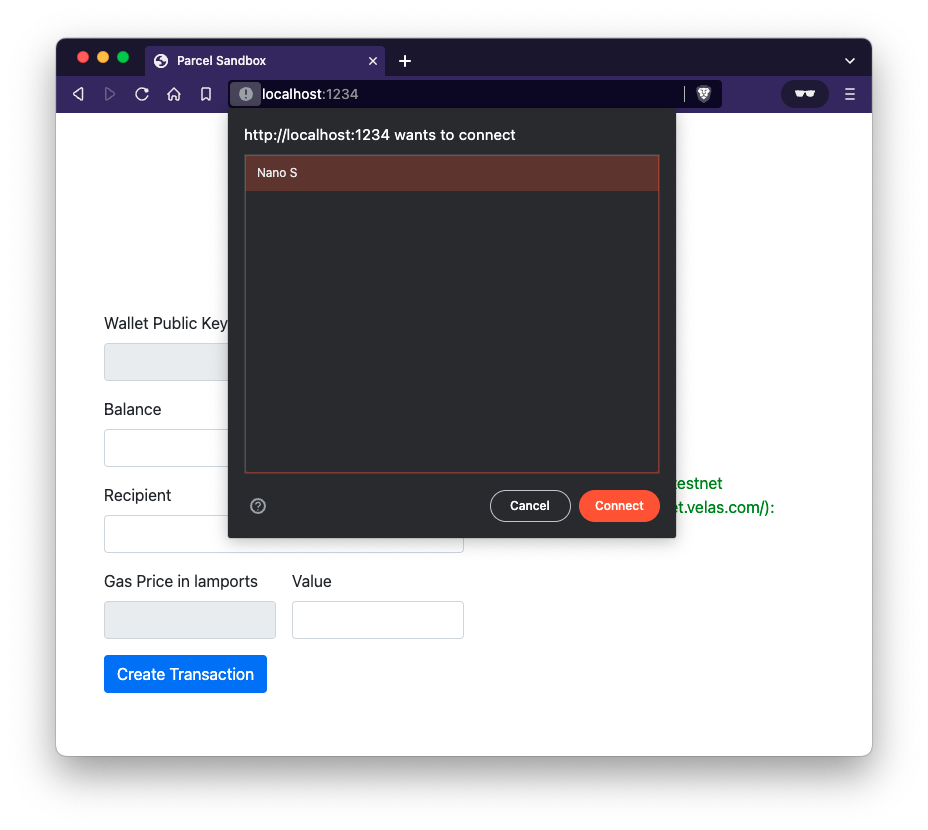
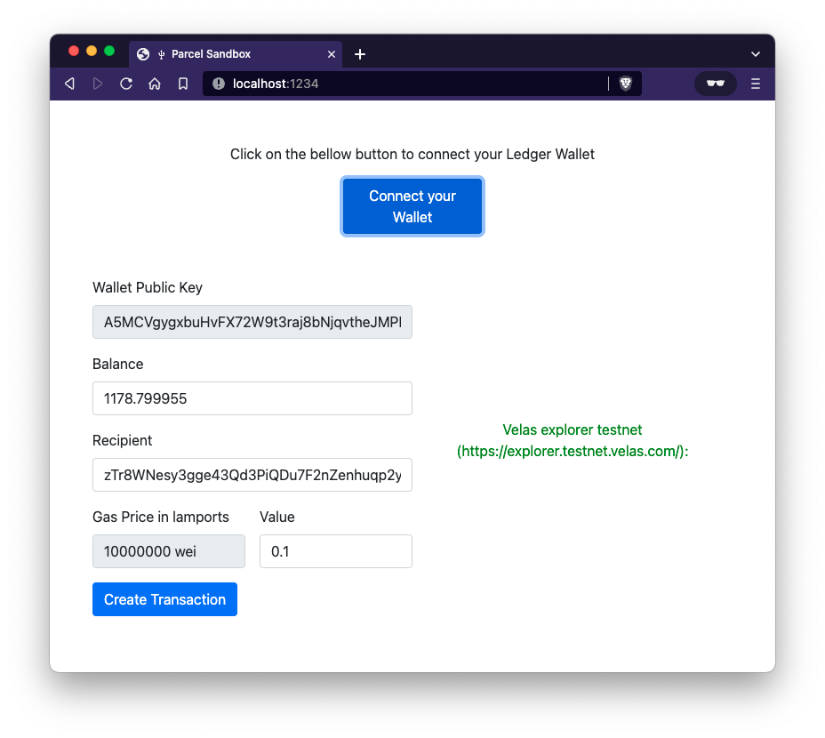
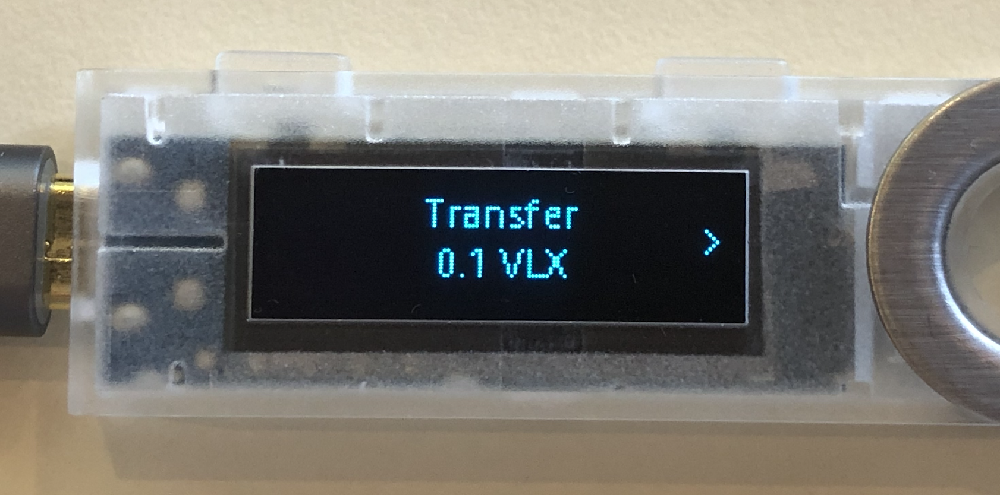
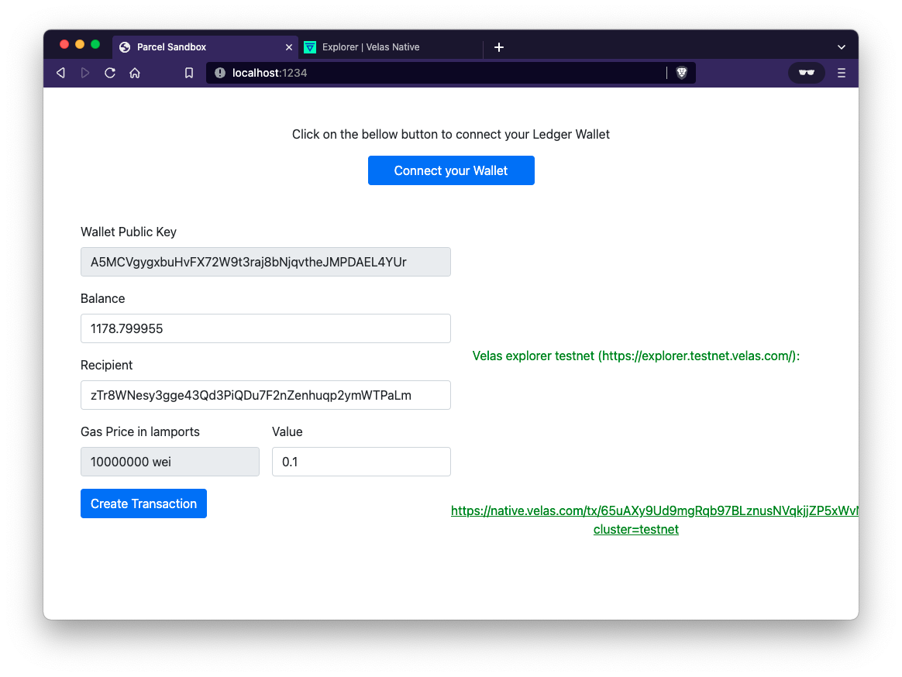
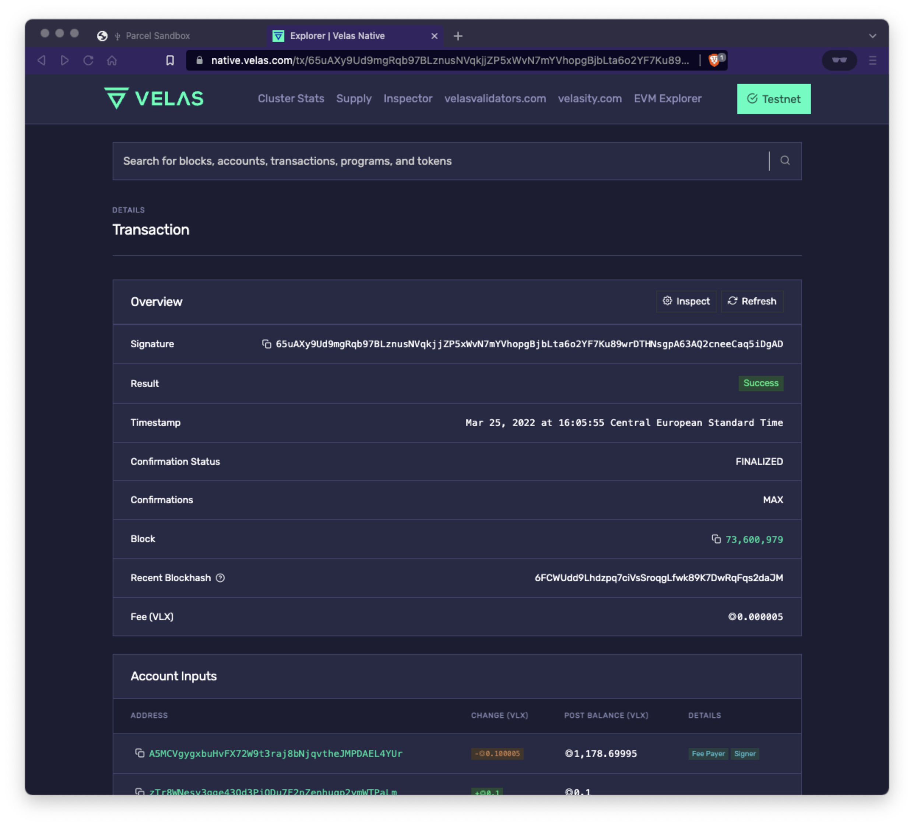

## Introduction
In this section, we will guide you through the creation of an application. This application will create a transaction that will be signed with the Ledger Nano before sending it to the blockchain.
The purpose of the application is to transfer VLX from your Velas account on your Ledger to another account.

### Install the Velas Nano App
First you need to install the Velas Nano App from Ledger Live.

### Start the Development Server
Start the development server:

```console
npm run start
```

Now the application is up and running. Open Chrome and go to [http://localhost:1234](http://localhost:1234), it will display :



*Fig. 3: Application Running on Browser*

### Plug Your Ledger Device
Before clicking on the text connect your Ledger to the USB port, unlock it and run the Velas application.
The steps are described below:

 - Ledger Enter Code Pin
 - Run Velas Application on Ledger Nano S
 - Velas Application is Running on Ledger Nano S

### Connect Your Ledger to the Application
Now you can click on the "Connect your Wallet" button and a modal will be opened.
Click on the Ledger logo.

Now choose the Ledger Nano to connect it to the browser.



After connecting the Nano, If all goes well, the input fields will be filled with data. The greyed input is not to be changed and it is directly extracted either from the blockchain or from your Ledger Nano application.


### Send VLX token to your Ledger Nano Velas account
To send some VLX tokens on the TestNet network, you can do it with the velas cli:

- [Velas CLI](https://docs.velas.com/cli/transfer-tokens)

The Velas Testnet is not visible on Ledger Live, you can then check the transaction passed on [the Velas Explorer](https://native.velas.com/?cluster=testnet). 

#### Velas CLI
Go to the [Velas CLI](https://docs.velas.com/cli/transfer-tokens) website, there are the steps to add some VLX to your account.

```console
velas airdrop 10 <RECIPIENT_ACCOUNT_ADDRESS> --url https://explorer.testnet.velas.com/rpc
```
For example
```console
velas airdrop 1 72tCcW6F4gRWJLCXf3RGejNDZBwUvWCfxHTdxoLGV4ht --url https://explorer.testnet.velas.com/rpc
```

### Create a transaction to transfer VLX

Now that the inputs are filled with data. It is time to transfer some VLX tokens from your Ledger Velas account to another account (you can keep the default account on the "index.js" file).  
Therefore, click on "Create Transaction" to create the transaction which will be signed by your ledger before sending it to the blockchain.  



When the transaction proceed and finalize, an URL will be displayed on the screen. This URL is a link to Velas Explorer to review the transaction.  
There you can find all the information concerning the transaction you have previously sent.



If you go on Velas Explorer you can see the information of your transaction.



Congratulations, you have successfully built your first transfer application connected with Ledger !!!